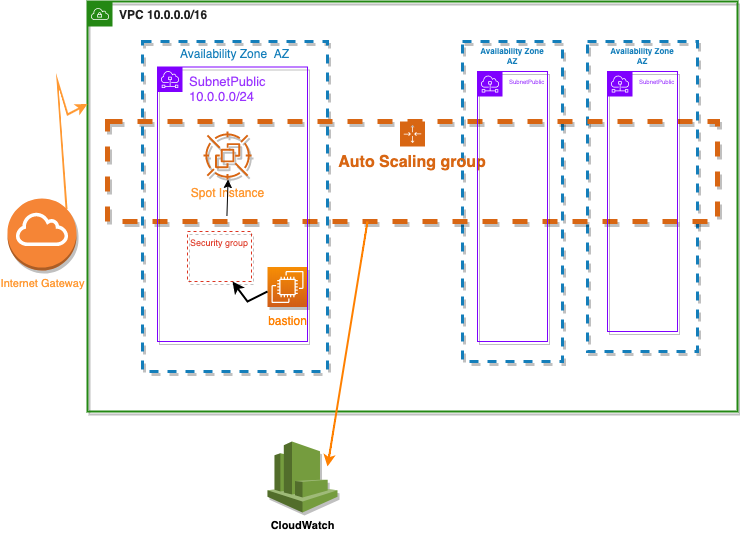

### Coda 

<a href="https://codaprotocol.com">Coda</a>, developed by O(1) Labs, is the first cryptocurrency with a succinct blockchain. Unlike Bitcoin a Ethurum, Coda uses <a href="https://www.binance.vision/blockchain/zk-snarks-and-zk-starks-explained"> zk-SNARKs </a>, a zero-knowledge proof, to maintain a constant-sized blockchain. 
Actually, recursive ZK-snarks takes snapshot of the blockchain satate's and compress it down to a fixed size of around 20kb, small enough to be easily stored on most modern devices, also it uses a methodology to certify computations proving that the blockchain was updated correctly.

### What's in this repository?

We develop an Infrastructure As Code to deploy your CODA NODE on AWS using cost effective spot instances based on Cloudformation stack that can be deployed automatically through Continuous Deployment platform. You can either deploy it manually using `Makefile` tasks or automate it as we do with our CI Platform.

### Requirements 

* [AWS CLI](https://docs.aws.amazon.com/fr_fr/cli/latest/userguide/install-cliv2.html)
* pip3 
* [Packer installed](https://packer.io/intro/getting-started/install.html)

### Infrastructure

Scheme



Infrastructure components : 
* VPC
* Spot instance(EC2) type C5.2xlarge which contains the generated private image (coda)by paker
* Auto scaling : is a way to automatically scale up or down the number of compute resources that are being allocated to your
  application based on its needs at any given time
* Subnets public : which can be generated by auto scaling up to 6 depending on the areas available in each region
* security group : acts as a virtual firewall that controls traffic in and out of instance
* bastion:  we go through the bastion to connect to the instance via ssh 
* Internet Gateway: allows communication between instance and the Internet
* CloudWatch: set alarms, and automatically reacts to resource changes.

#### Deploy init.yml 

First, deploy init.yml AWS CloudFormation template, in order to create an AWS user, attach role and generate access keys for this user. It will be used to deploy Cloudformation stacks.
 
#### Setup AWS CLI

Use the output values of the deployed init stack to configure an AWS CLI profile.
 
```bash
$ aws configure --profile <your-profile-name>
AWS Access Key ID [None]: <your-aws-access-key-id>
AWS Secret Access Key [None]: <your-aws-secret-access-key>
Default region name [None]: <your-region>
Default output format [None]:
```
#### Import Wallet to S3

Your CODA Wallet must be secured into Server Side Encrypted S3 Bucket.
Create your own bucket and store the three files under:
 - my-wallet
 - my-wallet.pub
 - my-wallet.password
 
#### Set development specific variables

Copy the `.env.dist` file to `.env` file and fill in the missing variables depending on your AWS development stack.

#### Ami Coda creation 

```bash
make packer-validate
make build-ami
```
#### Deploy stack 

```bash
make deploy
```

#### Delete stack

```bash
make delete 
```

